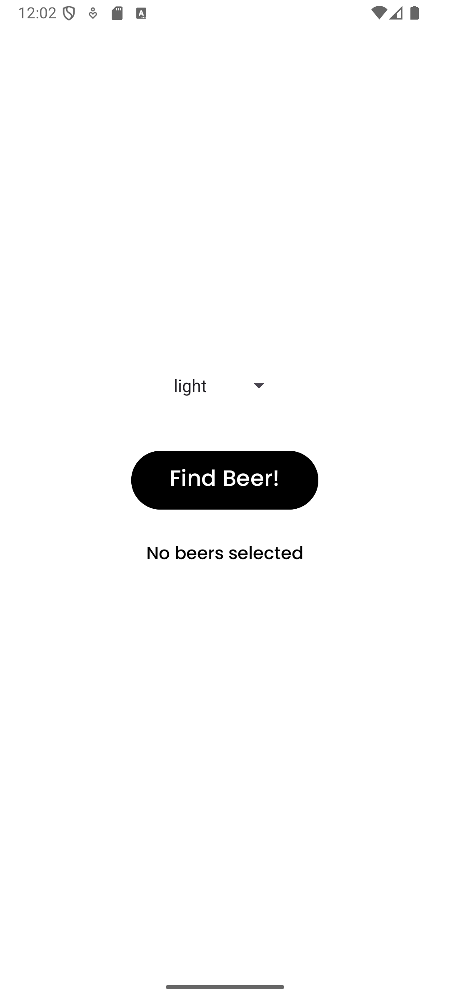
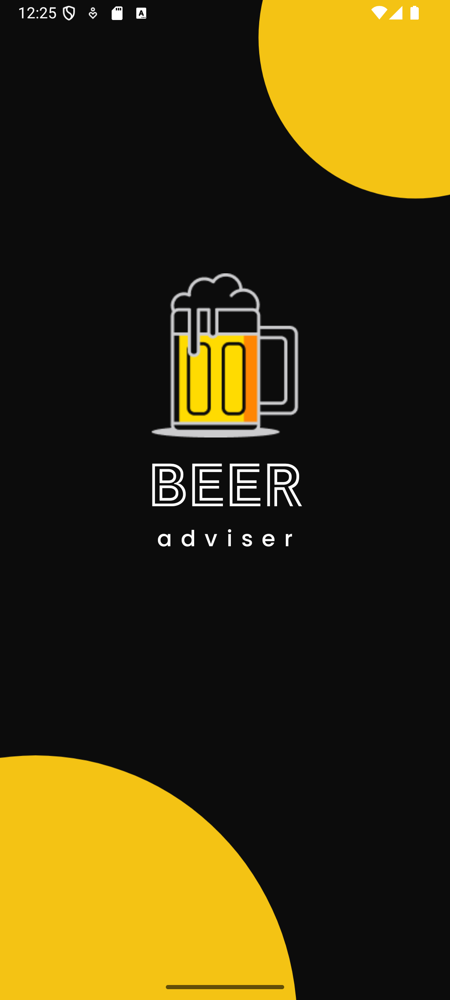
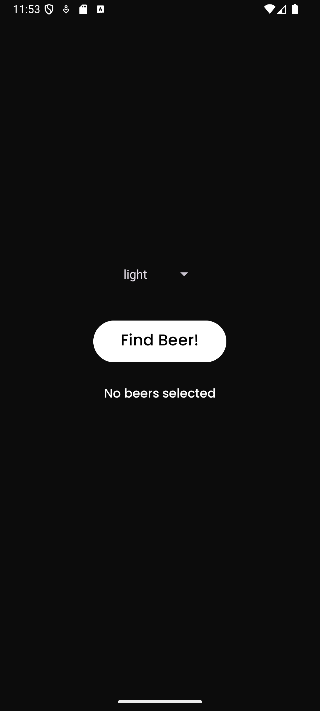

# Beer Adviser 🍺 (Kotlin Edition)

**Beer Adviser** is a simple Android app built as a learning project while studying Android development using the *"Head First Android Development"* book by O'Reilly.

This version of the app is written in **Kotlin** and recreates the same functionality as the original Java version. It serves as a practical example of building basic UI elements and working with logic in a modern Android application.

## Features ✨

- Select beer color using a dropdown menu (`Spinner`)
- Get beer brand suggestions based on your selection
- Styled UI with custom fonts and background
- Splash screen with
- Dark theme support

## Technologies Used

- Kotlin
- Android SDK
- Android Studio
- XML for layout
- Vector assets and custom fonts

## Screenshots

<table>
  <tr>
    <td></td>
    <td></td>
    <td></td>
    <td></td>
  </tr>
  <tr>
    <td colspan="2" align="center">Light Theme</td>
    <td colspan="2" align="center">Dark Theme</td>
  </tr>
</table>

## Getting Started

To build and run the project locally:

1. Clone this repository:
   
```bash
git clone https://github.com/The-uncanny-valley/MyBeerAdviser
```

2. Open the project in Android Studio

3. Build and run on an emulator or physical device (API 24+)

## License

You are free to use, modify, and share this code for any purpose.
